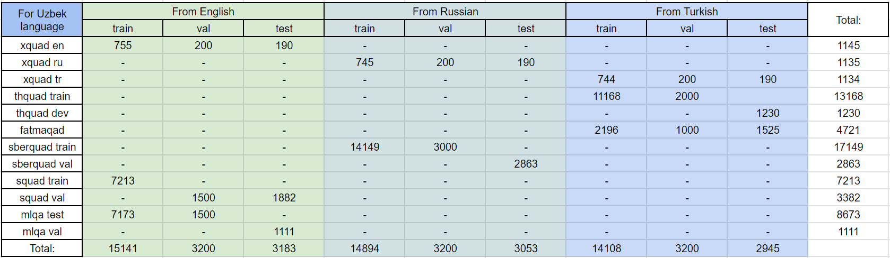

# Добро пожаловать на студенческий проект, посвященный решению задачи QA для низкоресурсных языков на примере казахского и узбекского языка
# Welcome to the student project dedicated to solving the QA task for low-resource languages using the example of Kazakh and Uzbek

**Заметка**: Низкоресурсные языки отличаются от высокоресурсных языков (например, английского, русского или турецкого) тем, что для них существует сравнительно мало данных для обучения моделей, из-за чего качество моделей для низкоресурсных языков сильно хуже моделей для высокоресурсных языков.

**Note**: Low-resource languages differ from high-resource languages (for example, English, Russian or Turkish) in that there is relatively little data for them to train models, which is why the quality of models for low-resource languages is much worse than models for high-resource languages.

## Результаты коротко / Brief results

В рамках этого проекты были созданы модели, показывающие лучшие результаты, чем все другие публично доступные аналоги. 

Это доступные на [HF](https://huggingface.co/med-alex) модели: / These are the models available on [HF](https://huggingface.co/med-alex):
- [med-alex/xlm-roberta-large-squad-ft-qa-en-mt-to-kaz]() – для казахского языка / for Kazakh language;
- [med-alex/xlm-roberta-large-squad-ft-qa-en-mt-to-uzn]() – для узбекского языка / for Uzbek language.
- [med-alex/xlm-roberta-base-squad-ft-qa-en-mt-to-kaz]() – для казахского языка / for Kazakh language;
- [med-alex/xlm-roberta-base-squad-ft-qa-en-mt-to-uzn]() – для узбекского языка / for Uzbek language.

## Основная идея / The main idea
В этом проекте была сделана попытка преодолеть проблему маленького количества данных, c помощью использования для дообучения QA-данных, переведенных с высокоресусрных языков. Но для перевода использовался не станадртный машинный перевод в комбинации с alingment, а модификация подхода, предложенного [EasyProject](https://github.com/edchengg/easyproject). Подход предпологает машинный перевод с использованием специальных маркеров (квадратных скобок), окружающих целевой спан в тексте, а для их сохранения при переводе авторы дообучили NLLB. Такой метод обеспечивает немного лучшие итоговые результаты, чем традиционный. В данной работе использовался NLLB версии [ychenNLP/nllb-200-3.3B-easyproject](https://huggingface.co/ychenNLP/nllb-200-3.3B-easyproject). В отличии от авторов EasyProject, в этой работе также было уделено внимание [постпроцессингу](https://github.com/med-alex/turkic_qa/blob/add_data/scripts/data_preprocessing/post_translation_preprocessing.py) переведенных данных, чтобы дополнительно повысить их качество.

In this project, an attempt was made to overcome the problem of a small amount of data, by using QA-data translated from high-resource languages for further fine-tuning. However, for the translation, not standard machine translation in combination with alignment was used, but a modification of the approach proposed by [EasyProject] (https://github.com/edchengg/easyproject ). The approach assumes machine translation using special markers (square brackets) surrounding the target span in the text, and in order to save them during translation, the authors have trained NLLB. This method provides slightly better final results than the traditional one. In this work, the NLLB version [ychenNLP/nllb-200-3.3B-easyproject] was used(https://huggingface.co/ychenNLP/nllb-200-3.3B-easyproject ). Unlike the authors of EasyProject, this work also paid attention to [postprocessing](https://github.com/med-alex/turkic_qa/blob/add_data/scripts/data_preprocessing/post_translation_preprocessing.py) of translated data to further improve it's quality.

## Использованные данные / Used data
Исходные датасеты на высокоресурсных языках и сформированные из них данные на казахском и узбекском языках можно увидеть на изображении ниже. Также сами данные можно найти на [HF автора](https://huggingface.co/med-alex).

The source datasets in high-resource languages and the data generated from them in Kazakh and Uzbek can be seen in the image below. Also the data itself can be found on the [author's HF](https://huggingface.co/med-alex).

Для казахского языка / For Kazakh language:

Для узбекского языка / For Uzbek language:

Использованые для перевода оригинальные датасеты: / Used for translation original datasets:

- [XQuAD](https://huggingface.co/datasets/google/xquad)
- [THQuAD](https://github.com/okanvk/Turkish-Reading-Comprehension-Question-Answering-Dataset)
- [FatmaQAD](https://github.com/fzehracetin/turkish-question-answering)
- [SberQuAD](kuznetsoffandrey/sberquad)
- [SQuAD 1.1](https://huggingface.co/datasets/rajpurkar/squad)
- [MLQA](https://huggingface.co/datasets/facebook/mlqa)

## Тестовые оригинальные данные / Original data for testing

Для объективной оценки результатов полученные модели были проверены на оригинальных датасетах: / For an objective assessment of the results, the obtained models were tested on the original datasets:

- [KazQAD](https://huggingface.co/datasets/issai/kazqad) - для казахского языка / for Kazakh language;
- [sKQuAD](https://huggingface.co/datasets/Kyrmasch/sKQuAD) - для казахского языка / for Kazakh language;
- [Belebele](https://huggingface.co/datasets/facebook/belebele) - были выбраны строки, подходящие для QA-задачи. Это 102 строки для казахского языка и 131 строка для узбекского языка. Эти датасеты можно найти на [HF автора](https://huggingface.co/med-alex). / the lines suitable for the QA task were selected. These are 102 lines for Kazakh language and 131 lines for Uzbek language. This data can by found on the [autor's HF](https://huggingface.co/med-alex).

## Результаты целиком / Full results

На переведенных данных на казахском и узбекском языках было дообученно несколько базовых моделей - мультиязычных и одноязычных, также разных архитектур. Полученные модели были протестированы на тестовых частях переведенных датасетов и оригинальных датасетах на казахском и узбекском языках. Также были протестированы публично доступные модели аналоги, для того, чтобы сравнить полученные модели с другими. Созданные в рамках работы модели показали лучшие результаты, чем все аналогичные публичные и представленные в литературе, например, в работе авторов KazQAD. Одноязычные модели уже не добились высоких результатов. Модели, дообученные на основе данных на английском языке показали лучшие результаты, поскольку NLLB обеспечивает лучшее качество перевода именно с английского языка. Все результаты можно увидеть на изображениях ниже.

Several basic models - multilingual and monolingual, as well as different architectures - were trained on the translated data in Kazakh and Uzbek. The resulting models were tested on test parts of translated datasets and original datasets in Kazakh and Uzbek languages. Publicly available analog models were also tested in order to compare the resulting models with others. The models created within the framework of the work showed better results than all similar public ones and presented in the literature, for example, in the work of the authors of KazQAD. Monolingual models have already failed to achieve high results. Models that were retrained based on data in English showed the best results, since NLLB provides the best translation quality from English. All the results can be seen in the images below.

Лучшие результаты показали модели: / The best results were shown by the models:

- [med-alex/xlm-roberta-large-squad-ft-qa-en-mt-to-kaz]() – для казахского языка / for Kazakh language;
- [med-alex/xlm-roberta-large-squad-ft-qa-en-mt-to-uzn]() – для узбекского языка / for Uzbek language.

Также стоит обратить внимание на "базовые" модели: / It is also worth paying attention to the "base" models:

- [med-alex/xlm-roberta-base-squad-ft-qa-en-mt-to-kaz]() – для казахского языка / for Kazakh language;
- [med-alex/xlm-roberta-base-squad-ft-qa-en-mt-to-uzn]() – для узбекского языка / for Uzbek language.

Результаты для пары языков английский-казахский:

Результаты для пары языков английский-узбекский:

Результаты для пары языков русский-казахский:

Результаты для пары языков русский-узбекский:

Результаты для пары языков турецкий-казахский:

Результаты для пары языков турецкий-узбекский:

